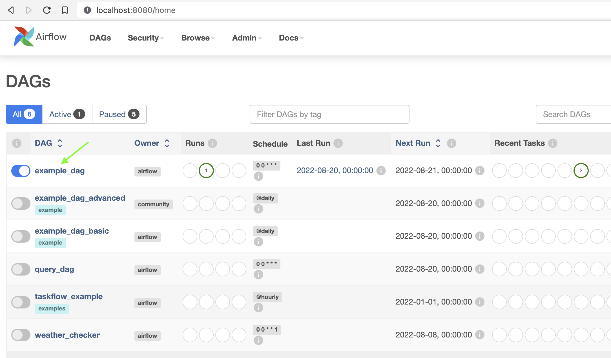
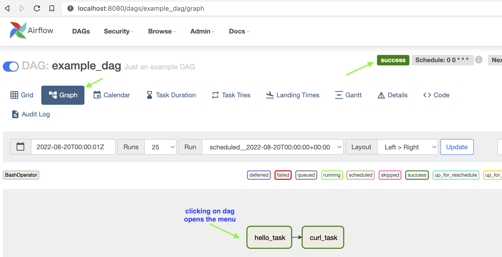
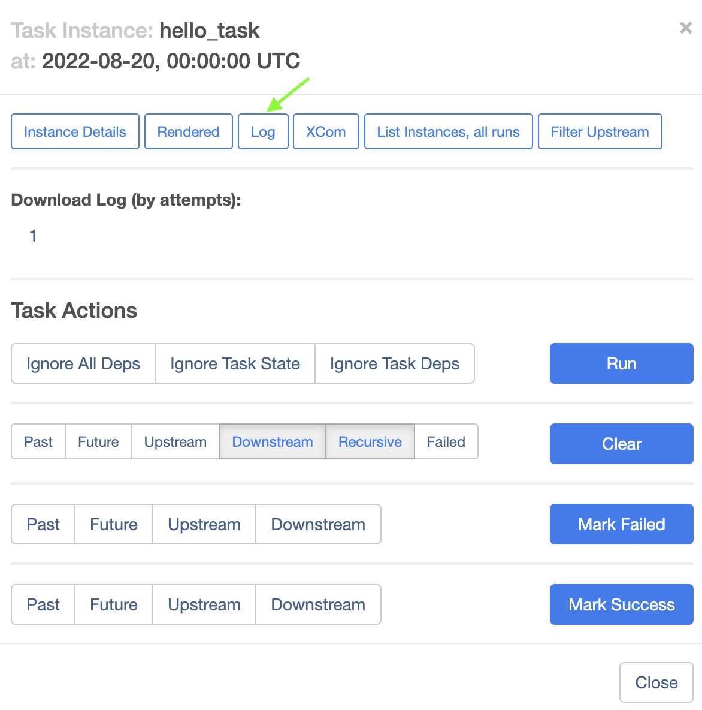
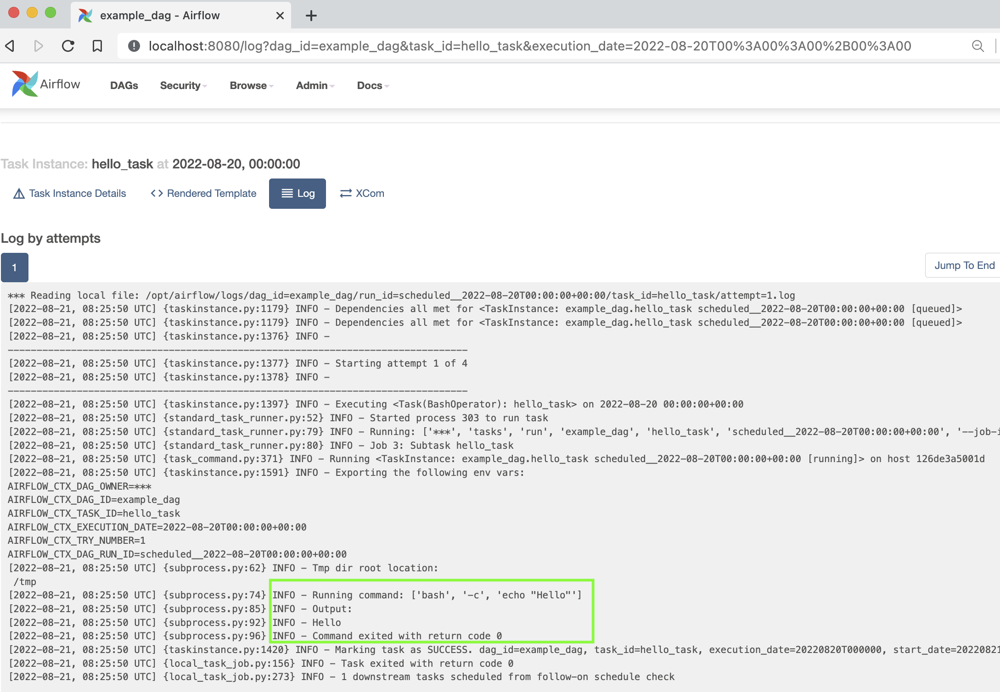

## What we learned in previous chapter
- Create first version of the docker application that fetches the end of day price and store it in MySQL database

## Current Chapter Scope
- Learn about Airflow (scheduler)
- Launch airflow container and shut it down

## What is Airflow
[first google link](https://www.upsolver.com/blog/apache-airflow-when-to-use-it-when-to-avoid-it-while-building-a-data-lake)

Apache Airflow is a powerful and widely-used open-source workflow management system (WMS) designed to 
programmatically author, schedule, orchestrate, and monitor data pipelines and workflows. 
Airflow enables you to manage your data pipelines by authoring workflows as Directed Acyclic Graphs (DAGs) of tasks. 
There’s no concept of data input or output – just flow. You manage task scheduling as code, and can visualize your 
data pipelines’ dependencies, progress, logs, code, trigger tasks, and success status.

## Running Airflow in Docker
[Getting Started](https://airflow.apache.org/docs/apache-airflow/stable/start/docker.html)
1. Initialize the environment (_from getting started link_)
```  
$ mkdir -p ./dags ./logs ./plugins  
$ echo -e "AIRFLOW_UID=$(id -u)" > .env  
```
2. Initialize Airflow database
__NOTE:__ _To remove the sample examples that come with airflow in docker-compose.yaml set:  
AIRFLOW__CORE__LOAD_EXAMPLES: 'false' and then execute the command below_
```
$ docker-compose up airflow-init  
```
3. Start Airflow   
`$ docker-compose up`
4. Check Aiflow status   
```
$ docker-compose ps
NAME                            COMMAND                  SERVICE             STATUS              PORTS
docker006-airflow-init-1        "/bin/bash -c 'funct…"   airflow-init        exited (0)          
docker006-airflow-scheduler-1   "/usr/bin/dumb-init …"   airflow-scheduler   running (healthy)   8080/tcp
docker006-airflow-triggerer-1   "/usr/bin/dumb-init …"   airflow-triggerer   running (healthy)   8080/tcp
docker006-airflow-webserver-1   "/usr/bin/dumb-init …"   airflow-webserver   running (healthy)   0.0.0.0:8080->8080/tcp
docker006-airflow-worker-1      "/usr/bin/dumb-init …"   airflow-worker      running (healthy)   8080/tcp
docker006-postgres-1            "docker-entrypoint.s…"   postgres            running (healthy)   5432/tcp
docker006-redis-1               "docker-entrypoint.s…"   redis               running (healthy)   6379/tcp
```
5. Accessing the web interface
* login via browser  
> http://localhost:8080
> The default account login details:    
> __login:__ airflow   
> __password:__ airflow
* Running Sample Application by enabling dag

* Check run status

* Check run logs


6. Stop Airflow   
```
$ docker-compose down
WARNING: The AIRFLOW_UID variable is not set. Defaulting to a blank string.
Stopping docker006_airflow-worker_1    ... done
Stopping docker006_airflow-webserver_1 ... done
Stopping docker006_airflow-triggerer_1 ... done
Stopping docker006_airflow-scheduler_1 ... done
Stopping docker006_postgres_1          ... done
Stopping docker006_redis_1             ... done
Removing docker006_airflow-worker_1    ... done
Removing docker006_airflow-webserver_1 ... done
Removing docker006_airflow-triggerer_1 ... done
Removing docker006_airflow-scheduler_1 ... done
Removing docker006_airflow-init_1      ... done
Removing docker006_postgres_1          ... done
Removing docker006_redis_1             ... done
Removing network docker006_default
```

### Accessing the postgress DB
```
$ docker exec -it docker006-postgres-1  psql -d airflow -U airflow  
```
_NOTE: docker006-postgres-1 came from above command docker-compose ps_
### Cleaning up
__To stop and delete containers, delete volumes with database data and download images, run:__  
```
$ docker-compose down --volumes --rmi all
```

### Few Postgres SQL commands
[Reference Link](https://www.postgresqltutorial.com/postgresql-administration/psql-commands/)  
(_from above link_)  
```
login: psql -h host -d database -U user -W  
e.g. 
$ docker exec -it docker006-postgres-1 
$ psql  -d airflow -U airflow -W
> list databases: \l  
> list tables: \dt  
> describe table: \d table_name
> quit postgres: \q  
```

## Summary
What we learned here is: 
- Setting up Airflow
- Starting, shutting down airflow
- Run Airflow examples and view the results